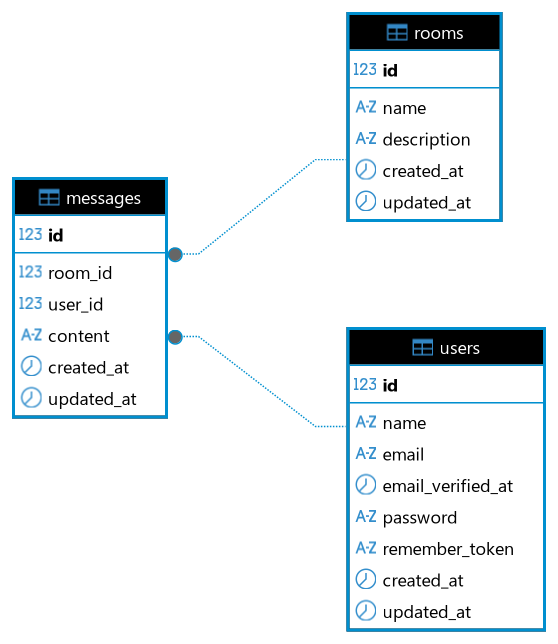

# 💬 Real-Time Chat — Laravel Reverb & React

Este repositório contém a solução para o Desafio Técnico de criação de um chat em tempo real. A aplicação permite que usuários autenticados criem salas, troquem mensagens instantaneamente e vejam quem está online, tudo com comunicação bidirecional via WebSockets.

---

## 🚀 Tecnologias Utilizadas

### Backend:
- **Laravel 13**: Framework base.
- **Laravel Reverb**: Servidor WebSocket nativo do ecossistema Laravel para comunicação em tempo real sem dependência de serviços externos (como Pusher).
- **Laravel Sanctum**: Autenticação via API Tokens para a SPA.
- **Banco de Dados**: MySQL.
### Frontend:
- **React + Vite**: Para renderização rápida e ambiente de desenvolvimento otimizado.
- **React Router Dom**: Para gestão de rotas protegidas e navegação (SPA).
- **Laravel Echo & Pusher-js**: Clientes para escuta e emissão de eventos WebSocket.
- **Axios**: Cliente HTTP configurado com interceptors para injeção automática de tokens.
---

## ✨ Funcionalidades Implementadas

- **Autenticação Completa**: Registro, Login e Logout (com revogação de tokens).
- **Gestão de Salas**: Listagem de salas disponíveis e criação de novos ambientes (com nome e descrição).
- **Chat em Tempo Real**: Envio e recebimento instantâneo de mensagens.
- **Histórico de Mensagens**: Carregamento paginado de mensagens ao entrar em uma sala, com auto-scroll.
- **Diferenciais Entregues**:
    - **Usuários Online (Presence Channel)**: Lista atualizada em tempo real de quem está visualizando a sala no momento.
    - **Indicador "Digitando..."**: Utilização de Client Events (Whisper) para feedback visual instantâneo sem sobrecarregar o banco de dados.
## Resumo das APIs criadas

- 🔐 **Autenticação e Usuário**

| # | Método | Endpoint | Protegida? | Descrição | Payload Esperado |
|---|--------|----------|------------|-----------|------------------|
| 1 | POST | `/api/register` | Não | Cria um novo usuário e retorna os dados junto com o token Sanctum. | `name`, `email`, `password` |
| 2 | POST | `/api/login` | Não | Autentica um usuário existente e retorna o token Sanctum. | `email`, `password` |
| 3 | GET | `/api/user` | Sim | Retorna os dados do usuário autenticado no momento. | Nenhum |
| 4 | POST | `/api/logout` | Sim | Revoga o token Bearer atual, efetivando o logout. | Nenhum |

- 🏠 **Salas de Chat**

| # | Método | Endpoint | Protegida? | Descrição | Payload Esperado |
|---|--------|----------|------------|-----------|------------------|
| 1 | GET | `/api/rooms` | Sim | Lista todas as salas disponíveis no banco, ordenadas pelas mais recentes. | Nenhum |
| 2 | POST | `/api/rooms` | Sim | Cria uma nova sala de chat. | `name`, `description` (opcional) |

- 💬 **Mensagens e Tempo Real**

| # | Método | Endpoint | Protegida? | Descrição | Payload Esperado |
|---|--------|----------|------------|-----------|------------------|
| 1 | GET | `/api/rooms/{room}/messages` | Sim | Retorna o histórico de mensagens da sala de forma paginada, incluindo os dados do autor de cada mensagem. | Nenhum |
| 2 | POST | `/api/rooms/{room}/messages` | Sim | Salva uma nova mensagem no banco de dados e dispara o evento de Broadcast (`MessageSent`) para o WebSocket. | `content` |
| 3 | POST | `/broadcasting/auth` | Sim | Rota interna gerada pelo `Broadcast::routes()`. O Laravel Echo a utiliza automaticamente para validar se o usuário logado tem permissão para entrar no _Presence Channel_ da sala. | `socket_id`, `channel_name` |

---

## 🧠 Decisões Técnicas e Arquitetura

Tomei as seguintes decisões arquiteturais:
- **Banco de Dados**: O banco de dados foi modelado com relacionamentos que seguem a lógica de um usuário para muitas mensagens e um chat para muitas mensagens:

- **Separação Frontend / Backend**: O projeto está separando completamente a API (Laravel) da interface (React) para facilitar manutenção e melhorar a escalabilidade, formando o seguinte resumo da estrutura de pastas:
```text
desafio-fullstack/
│
├── backend/
│   ├── app/
│   │   ├── Events/
│   │   │   └──MessageSent.php
│   │   ├── Http/
│   │   │   └── Controllers/
│   │   │       ├── AuthController.php
│   │   │       ├── Controller.php
│   │   │       ├── MessageController.php
│   │   │       └── RoomController.php
│   │   ├── Models/
│   │   │   ├── Message.php
│   │   │   ├── Room.php
│   │   │   └── User.php
│   │   └── Providers/
│   ├── config/
│   ├── database/
│   │   ├── migrations/
│   │   └── ...
│   │  
│   ├── routes/
│   │   ├── api.php
│   │   ├── channels.php
│   │   ├── console.php
│   │   └── web.php
│   │
│   ├── .env.example
│   ├── Dockerfile
│   └── ...
│
├── frontend/
│   ├── public/
│   ├── src/
│   │   ├── assets/
│   │   ├── components/
│   │   │   └── ProtectedRoute.jsx
│   │   ├── contexts/
│   │   │   └── AuthContext.jsx
│   │   ├── pages/
│   │   │   ├── Auth.jsx
│   │   │   ├── Auth.module.css
│   │   │   ├── Chat.jsx
│   │   │   ├── Chat.module.css
│   │   │   ├── Rooms.jsx
│   │   │   └── Rooms.module.css
│   │   ├── services/
│   │   ├── App.css
│   │   ├── App.jsx
│   │   ├── index.css
│   │   └── main.jsx
│   ├── .env.example
│   ├── Dockerfile
│   ├── index.html
│   ├── package.json
│   ├── vite.config.ts
│   └── ...
│
├── docker-compose.yml
├── README.md
└── ...
```
- **Uso de Presence Channels**: O próprio canal gerencia a entrada (`.joining`), saída (`.leaving`) e estado atual (`.here`) dos usuários, poupando consultas pesadas ao banco de dados.
- **Proteção e Autorização de WebSockets**: O endpoint de autenticação do `broadcasting` foi configurado para validar o token Bearer do Sanctum, garantindo que apenas usuários logados e autorizados possam ler e escrever no chat.
- **Deduplicação de Estado no React**: Para lidar com os ciclos de renderização do React Strict Mode e possíveis flutuações de rede, implementei uma lógica de deduplicação (checagem de IDs) no frontend. Isso garante que mensagens e usuários não sejam duplicados na interface, tornando o client-side mais resiliente.
- **Context API para Autenticação**: Criei um `AuthContext` global para armazenar o estado do usuário e os tokens, evitando o prop drilling e facilitando a proteção das rotas com o componente `<ProtectedRoute>`.
---

## 🚧 Trade-offs e O que ficou de fora

O foco foi dado aos critérios de maior peso (Qualidade do Código e Integração com WebSocket).
1. **Design / UI Avançada**: Para não adicionar complexidade desnecessária com bibliotecas de componentes (como Material UI ou Tailwind), utilizei CSS inline estruturado e um pouco de CSS Modules. O foco foi entregar uma UX limpa, funcional e usável, priorizando a lógica do WebSocket.
2. **Mensagens Privadas (DMs) e Upload de Imagens**: Optei por focar na estabilidade e robustez do chat em grupo (salas). A adição de DMs e uploads exigiria configurações de bloqueio de acesso público e modelagens de banco mais complexas que poderiam comprometer o fluxo principal no tempo hábil.

---

## ⚙️ Como rodar o projeto localmente

### Pré-requisitos
- [Docker](https://www.docker.com/) e Docker Compose instalados.
### Passo a Passo

1. **Clone o repositório:**
   ```bash
   git clone [https://github.com/Jefferson-Antonio/desafio-fullstack/tree/challenge-realtime-chat](https://github.com/Jefferson-Antonio/desafio-fullstack.git)
   cd desafio-fullstack
2. **Configure os arquivos de ambiente**:
    
    Copie os arquivos de exemplo `.env.example` dentro das pastas `backend/` e `frontend/` para `.env`.
3. **Suba os containers Docker**:
    ```bash
    docker compose up --build
4. gere a chave da aplicação e execute as migrações do banco de dados:

    ```bash
    docker exec -it laravel_api php artisan key:generate
    docker exec -it laravel_api php artisan migrate --seed
5. Acesse a aplicação:

    Frontend (React): http://localhost:5173

    Backend API (Laravel): http://localhost:8000

    Reverb (WebSocket): ws://localhost:8080